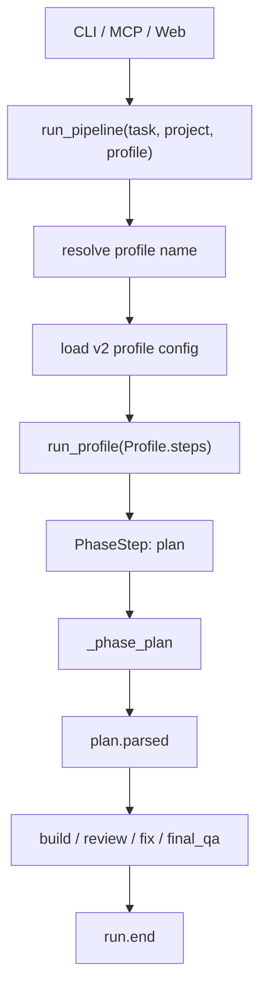
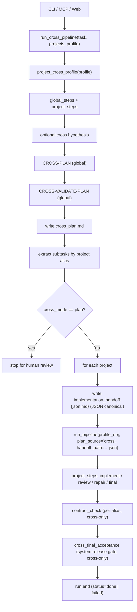
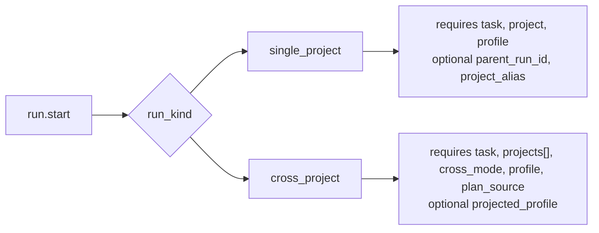

# Cross-Project Pipeline

Cross-project orchestration is a first-class run shape, not a single
project run with extra metadata. This matters for REA evidence,
MCP/Web timelines, and product positioning: the cross runner owns a
multi-project plan, fans out into per-project task runs, then validates
the integration contract across the whole change.

## Single-Project Run

Single-project runs are profile-driven. The caller supplies a profile
name, `run_pipeline()` resolves it from `_config/pipeline_profiles_v2.json`
plus `orcho.profiles` plugin entries, then `run_profile()` walks the
declared `Profile.steps`.



Event identity:

```json
{
  "kind": "run.start",
  "payload": {
    "run_kind": "single_project",
    "task": "...",
    "project": "/repo/app",
    "profile": "advanced"
  }
}
```

Key rule: the profile owns topology. `advanced` can declare
`loop(plan, validate_plan)`, `lite` can declare
`plan -> implement -> final_acceptance`, and `task` can skip planning
entirely.

## Cross-Project Run

Cross-project runs are driven by **profile projection**:
the requested `--profile` is loaded, split into `global_steps` +
`project_steps` via per-step `cross` policy, and applied to both
levels. Children run an in-memory `Profile` built from
`project_steps` — there is no separate sub-profile flag.

A profile annotates each step with optional `cross: { scope, handler? }`:

* `scope=global` → runs once at the cross level. `handler` (optional)
  selects the cross-level function (`cross_plan`,
  `cross_validate_plan`). The step's semantic phase name is preserved
  so loop predicates like `until: validate_plan.approved` still match.
* `scope=project` → runs inside each child sub-pipeline.
* `scope=both` → both lists.
* `scope=skip` → omitted entirely in cross mode.

`LoopStep` inner steps must agree on scope (mixed loops are an error).
Coherence rule: project-scoped `implement` or `repair_changes` requires
at least one global `plan` / `validate_plan` step to produce a handoff;
the `task` scoped profile is rejected for cross mode.

`contract_check` is **not** a profile step. The cross runner appends it
as a cross-only per-alias gate after all project pipelines finish; mono
runs never invoke it. Contract-check verdicts are recorded in
`session.phases.contract_check[alias]` and feed into the system
release gate below.

`cross_final_acceptance` is the **system release
gate**: a single cross-only terminal step that runs once after
`contract_check`. Same reservation as `contract_check` — never a
profile step. The gate answers "can the coordinated multi-repo
change ship as one system?" — distinct from per-alias contract
matching. It runs in two paths:

* **Precondition path** (no agent call) — synthesises a REJECTED
  release verdict when any upstream signal blocks ship: missing /
  crashed child sub-pipeline, missing per-project release verdict,
  per-project `final_acceptance.ship_ready == false`, contract_check
  REJECTED, or parse error upstream. Each violation produces one
  release blocker with a `CFA_*` id prefix.
* **Agent path** — preconditions pass → invokes the cross reviewer
  with the cross plan + per-project release verdicts + contract check
  results, parses via `parse_release` (Phase 1 contract).

The runner sets `session.status` in exactly one place, AFTER the gate
records its phase entry. `contract_check` no longer writes terminal
status in full cross runs — it produces results + a flag that the
gate consumes through preconditions. Parse errors or REJECTED
verdicts from the gate mark `status="failed"` and CLI exit 1.

When the optional cross-hypothesis stage is enabled and QA approves a
hypothesis, the macro-orchestrator adds it to the generated CROSS-PLAN
turn as a typed `VALIDATED HYPOTHESIS (QA-approved planning context)` segment
— via `PromptTurnEditor`, not a raw string append (ADR 0060). This is a
planning input, not execution approval: the generated plan should incorporate
that direction, verify or falsify the riskiest assumption early, or explain why
it diverges.

When every hypothesis attempt is **rejected** by QA, the macro-orchestrator
still surfaces the reviewer's work to CROSS-PLAN — but as **negative
planning context**, never as direction. The collected findings, risks, and
checks are added as a `REJECTED HYPOTHESIS FEEDBACK (not validated
direction)` segment the same way. The planner is told to avoid rejected reasoning, address
reviewer concerns, verify missing assumptions, or plan from first
principles. The wording explicitly disclaims direction so a rejected
hypothesis can never be mistaken for an approved fix path.



`cross_final_acceptance` is the single terminal step that writes
`session.status`. Failure modes that surface here as release blockers
with `CFA_*` ids:

| Blocker id prefix | Cause |
|---|---|
| `CFA_MISSING_CHILD_<alias>` | child sub-pipeline crashed (exception caught, run continues to the gate) or never produced a sub-session entry |
| `CFA_MISSING_RELEASE_<alias>` | child sub-session has no `final_acceptance` entry or missing release fields (e.g. profile skipped final_acceptance) |
| `CFA_CHILD_REJECTED_<alias>` | per-project `final_acceptance.ship_ready == false` |
| `CFA_CONTRACT_REJECTED_<alias>` | `contract_check[alias].verdict == "REJECTED"` |
| `CFA_PARSE_ERROR_<alias>` | parse error in upstream `final_acceptance` or `contract_check` |

Event identity:

```json
{
  "kind": "run.start",
  "payload": {
    "run_kind": "cross_project",
    "task": "...",
    "projects": [
      {"alias": "api", "path": "/repo/api"},
      {"alias": "web", "path": "/repo/web"}
    ],
    "cross_mode": "full",
    "profile": "advanced",
    "plan_source": "cross",
    "projected_profile": "advanced#project"
  }
}
```

Key rule: a single profile drives both levels via projection. The CLI
exposes one `--profile` flag — no separate `--sub-profile`. Profiles
without `cross` metadata stay valid for mono runs; the cross runner
rejects them with an actionable error.

### Handoff artifacts

After cross planning approves, the cross runner writes per-child
`implementation_handoff.{json,md}` under `<run_dir>/<alias>/`. Per
ADR 0050 the **JSON is the source of truth**: `write_handoff` validates
the typed `Handoff` (required fields present, source path never leaking
into the rendered body) and returns the JSON path, which is passed to
the child `run_pipeline` via `handoff_path`. The `.md` is a derived
audit/human view rendered from the same typed object — not the data
channel. The child loads + re-validates the JSON and renders the prompt
body from the typed object (`render_handoff_markdown`); phase handlers
prepend that body (read from `state.extras["cross_handoff"]`) before the
existing plan contract via the pure builders' `handoff_contract`
parameter. The handoff requirement is keyed on phase presence: required
when the projected profile contains `implement` or `repair_changes`;
review-only profiles run without one. v1 handoffs carry
`full_cross_plan_markdown`, `project_subtask`, `cross_validation_summary`,
and `sibling_aliases`; the source `project_path` is retained in the JSON
for audit only and is never rendered into the runtime body — the
authoritative path is the child worktree from its own context block.
Structured contract fields are deferred to a follow-up grammar redesign.

## Event Schema

`run.start` is a discriminated union:



This avoids lossy fields such as `project=null`, `project=common_cwd`,
or `project OR projects`. Consumers can validate the payload without
guessing which run shape they are reading.

### Child-run linkage (REA-3.6)

When the cross orchestrator spawns a per-project run, the child's
`run.start` carries two extra fields:

- `parent_run_id` — the parent cross run's directory name (the
  user-visible run id on disk).
- `project_alias` — the alias from the parent's `projects[]` manifest,
  for example `"api"` or `"web"`.

Both fields are optional and either both present or both absent — the
schema validator rejects half-set payloads. With them, an MCP or evidence
consumer can rebuild the full parent → children → phases timeline from
`events.jsonl` alone, without needing to read `meta.json` or filesystem
layout.

```json
{
  "kind": "run.start",
  "payload": {
    "run_kind": "single_project",
    "task": "...",
    "project": "/repo/api",
    "profile": "task",
    "parent_run_id": "20260508_133045",
    "project_alias": "api"
  }
}
```

### Reviewer contract spine (REA-3.5 + REA-3.6)

The cross-project contract check (`CONTRACT_CHECK`) emits the
same typed JSON contract as every other reviewer phase. Each project's
contract review surfaces as a structured object in
`session.phases.contract_check[alias]`:

```json
{
  "verdict": "APPROVED",
  "short_summary": "Field names align across api and web; no inconsistencies.",
  "findings": [],
  "rendered": "# Contract Check — api\n...",
  "raw_response": "{\"verdict\":\"APPROVED\",...}"
}
```

`rendered` is the human-readable markdown Orcho generates from the parsed
contract; `raw_response` preserves the model's JSON for re-validation.
Malformed structured output is downgraded to `REJECTED` with a
`parse_error` field — the contract is the gate, not prose heuristics.

## After the gate: cross delivery and resume (pointers)

Two shipped mechanisms sit after `cross_final_acceptance` and are documented
by their ADRs rather than re-narrated here:

- **Cross delivery** ([ADR 0119](../adr/0119-delivery-branch-policy.md);
  `pipeline/cross_project/cross_delivery.py`) — runs only on the
  CFA-approved/override path, delivers per alias with a
  continue-on-failure loop, and aggregates to an overall outcome that
  finalization maps onto the terminal status (`ok`/`disabled` → `done`,
  `partial` → `cross_delivery_partial`, `failed` → `cross_delivery_failed`,
  `halted` → `halted`).
- **CFA pause/resume** (ADR 0038 cross parity; `cfa_gate.py`) — the gate
  outcome is a typed enum (`approved_terminal` / `paused` /
  `override_continue` / `halted` / `retry_consumed`); a paused resume
  preserves the operator override marker, and settle-time clears the
  `pending_gate` residue through the single run-state eviction point
  (ADR 0115).

## Improvement Plan

1. **Done (REA-2).** Event contract keeps cross-project as a first-class
   `run_kind` with a structured payload.
2. **Done (REA-3).** Evidence bundle renders the cross manifest: cross
   plan, project list, child run summaries, contract-check result,
   artifact paths.
3. **Done (REA-3.6).** Explicit child-run linkage on `run.start`:
   `parent_run_id` + `project_alias` together let consumers reconstruct
   the parent → children tree from events.
4. **Next: XPROJ-1.** Promote the cross macro-topology into a
   declarative shape with stages for `cross_plan`, `fanout`,
   `contract_check`, and configurable `per_project_profile`. This now
   sits after REA-4.4 live MCP progress and the git-worktree / DAG
   foundation, so the macro-run can compose with the same evidence and
   isolation model as single-project runs.
5. **Next: XPROJ-2.** Per-alias resume and control at the macro level.
   The current `cross_checkpoint.json` already supports skipping
   completed aliases; the milestone promotes that state into first-class
   evidence / events so MCP and Web consumers can inspect and recover
   aliases without filesystem inference.
