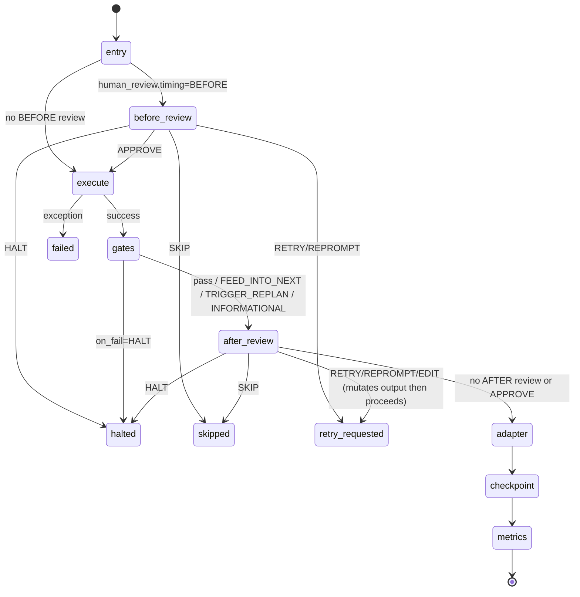

# Phase Lifecycle FSM

> Phase 5e-5 status: this FSM is the active dispatch engine for v2
> `Profile` / `PhaseStep` execution. Transitional callbacks remain only
> for orchestrator-owned banners, mock plan-file writes, checkpointing,
> and metrics; phase handlers now run through `PhaseLifecycle.execute_step`.

A single PhaseStep flows through a deterministic state machine. The
ordering is fixed in `pipeline/lifecycle.py:PhaseLifecycle.execute_step`
so Phase 4 (quality gates) and Phase 8 (human review) plug into
**reserved seats** rather than re-deriving "when do I run vs the
adapter?" each time.

## Transition diagram



## Stages

| Stage | Owner | Phase introduced | Short-circuit outcomes |
|-------|-------|------------------|------------------------|
| `before_review` | HumanReview backend | Phase 8 | HALTED / SKIPPED / RETRY_REQUESTED |
| `execute` | ExecutionMode dispatcher | Phase 2 | FAILED on exception |
| `gates` | QualityGateRunner | Phase 4 | HALTED on `on_fail=HALT` |
| `after_review` | HumanReview backend | Phase 8 | HALTED / SKIPPED / RETRY_REQUESTED (EDIT mutates output) |
| `adapter` | SessionAdapterRegistry | Phase 3 | current implementation lets adapter exceptions propagate through the FSM and surface as run failure |
| `checkpoint` | runtime | Phase 2 | logs warning on error, continues |
| `metrics` | runtime | Phase 2 | logs warning on error, continues |

## Outcome categories

Each stage may produce a `StepOutcome` (see `pipeline/lifecycle.py`):

- **COMPLETED** — all stages passed; runtime advances to the next step
- **SKIPPED** — explicit skip (HumanReview SKIP action, or
  `before_review` veto); next step proceeds with state unchanged
- **RETRY_REQUESTED** — caller (LoopStep dispatcher) re-executes the
  current step; carries `retry_payload` with `loop_round_delta`,
  `critique`, and `trigger ∈ {human, agent_ask}`
- **HALTED** — terminal stop with `reason`; outer profile walker stops
  before next entry
- **FAILED** — exception captured with `reason`; outer walker treats
  same as HALTED but distinguishes for run-summary classification

## RETRY_REQUESTED handling in `LoopStep`

`RETRY_REQUESTED` is reserved for Phase 8. Current Phase 5e-5 runtime
does not produce it yet; `LoopStep` continues to retry through normal
`until` predicate evaluation.

When an inner PhaseStep returns `StepStatus.RETRY_REQUESTED`, the loop
dispatcher (Phase 5) breaks the inner sequence and lets the outer
`for round_n` advance. The retry budget on `HumanReview.retry_budget`
caps how many RETRY/REPROMPT cycles can run before the outcome is
promoted to HALTED ("retry budget exhausted").

This means the same code path serves:

- The plan ↔ validate_plan loop (`validate_plan.approved` until predicate)
- A human asking for a different output (REPROMPT with critique)
- An agent asking for human input mid-execution (ask_human YAML block)

— without the loop dispatcher distinguishing the trigger.

## Phase handoff — declarative pause point

The lifecycle FSM above describes what happens **inside** a single
`PhaseStep`. The phase-handoff slice (see
[ADR 0031](../adr/0031-generic-phase-handoff-contract.md)) adds a
declarative pause point **between** phases inside a `LoopStep`,
driven by per-step `PhaseHandoffPolicy`:

```python
PhaseStep(
    phase="validate_plan",
    handoff=PhaseHandoffPolicy(
        type=PhaseHandoffType.HUMAN_FEEDBACK_ON_REJECT,
    ),
)
```

The handoff is **not** a lifecycle stage like `before_review` /
`after_review` — it lives one layer up, in the loop dispatcher. The
dispatcher inspects the step's verdict after the FSM returns
`COMPLETED` and, when the policy's trigger fires, raises a structured
`PhaseHandoffRequested` signal that the orchestrator turns into:

- `meta.status = "awaiting_phase_handoff"` (canonical pause status)
- `meta.phase_handoff = { id, phase, type, trigger, round, available_actions, … }`
- emitted `EventKind.PHASE_HANDOFF_REQUESTED`
- subprocess exit rc = 4

### Trigger discipline (slice 1 — validate_plan in plan loop)

| Policy | Verdict + state at end of round | Pause? | `available_actions` |
|--------|--------------------------------|--------|---------------------|
| `human_bypass` (default) | any | no | — |
| `human_feedback_on_reject` | `approved` | no | — |
| `human_feedback_on_reject` | `rejected`, `until` still false, mid-budget | no (loop replans) | — |
| `human_feedback_on_reject` | `rejected` on final automatic round | **yes** | `continue`, `retry_feedback`, `halt`, `continue_with_waiver` |
| `human_feedback_always` | `approved` | **yes** | `continue`, `retry_feedback`, `halt` |
| `human_feedback_always` | `rejected` | **yes** | `continue`, `retry_feedback`, `halt`, `continue_with_waiver` |

`available_actions` is **runtime-produced**: the loop dispatcher
decides which subset of `{continue, retry_feedback, halt,
continue_with_waiver}` is valid for the current pause based on the
verdict and policy type. Clients must validate the action they send
against the published list — the SDK refuses an action that isn't in
`available_actions`. `continue_with_waiver` is offered **only on
`rejected` verdicts** (an approved pause has nothing to waive); see
ADR 0072.

### `decide ≠ resume`

The contract intentionally splits the two operations:

1. **Decide** — `sdk.phase_handoff_decide(run_id, handoff_id, action,
   feedback?, note?)` writes
   `<run_dir>/phase_handoff_decisions/{safe_handoff_id}.json` and
   (for `halt`) synchronously flips `meta.status`. Never spawns a
   process. `continue` / `retry_feedback` / `continue_with_waiver`
   leave the run paused. `continue_with_waiver` **requires** a
   non-empty `feedback` (the operator verdict); the SDK rejects an
   empty waiver at decide time.
2. **Resume** — `orcho_run_resume(run_id)` spawns a fresh subprocess
   that reads `meta.phase_handoff` + the matching decision artifact
   and applies action semantics:
   - `continue` writes `state.extras["phase_handoff_override"]` so
     the loop runner exits without rewriting the machine verdict
     (which would re-enter the loop forever).
   - `retry_feedback` injects `state.last_critique = feedback` +
     `state.extras["human_feedback"]` and runs exactly one extra
     `plan → validate_plan` round. `LoopStep.max_rounds` is **not**
     mutated; a separate `human_directed_rounds` counter is bumped.
   - `continue_with_waiver` behaves like `continue` for control flow
     (machine verdict stays `rejected`, the loop is stripped, **no**
     extra reviewer round runs) but additionally records a durable
     waiver. It writes `run.session["phase_handoff_waiver"]` and
     `state.extras["phase_handoff_waiver"]` (carrying the operator
     verdict, the waived `findings`, and the prior reviewer
     `critique`) alongside the usual `phase_handoff_override`. The
     waiver survives a fresh-process resume by rehydrating from
     `meta.json` (see `pipeline/project/state_setup.py`), and is
     authoritatively injected into every downstream review gate
     (`review_changes`, `final_acceptance`) as a code-owned
     reconciliation directive so the waived findings are **not**
     reopened as blocking. The waiver also surfaces in the evidence
     bundle as a `phase_handoff_waiver` error entry for audit. See
     ADR 0072.

Decisions are exact-payload idempotent: replaying the same
`(handoff_id, action, feedback, note)` returns the persisted record
unchanged (artifact not rewritten, `decided_at` not refreshed). Any
field divergence for the same `handoff_id` raises
`InvalidPhaseHandoffState`. See ADR 0031 § 2 for the full matrix
including `halt`-after-`halt` replay semantics.

### Canonical state

There is one source of truth for active-pause state:
**`meta.phase_handoff`**. Everything else is a derived view —
`run.session["phase_handoff"]` (if still consumed by older UI
plumbing) is a compat mirror; the `phase.handoff_requested` event is
an emission record, not state; decision artifacts are audit log.
After `halt`, `meta.phase_handoff` is cleared even though the
artifact remains.

### Interactive advisory actions

When the interactive TTY prompt resolves a rejected/incomplete pause,
it can offer two **UI pseudo-actions** — `advice` and
`retry_with_advice` — on top of the four canonical actions. A
read-only advisor recommends the smallest honest way forward and, when
accepted, feeds the generated feedback through the **same**
`retry_feedback` decide + resume path above (no parallel branch). These
pseudo-actions never enter `available_actions` or
`phase_handoff_decide`; the recommendation is persisted under
`<run_dir>/phase_handoff_advice/` and linked from the decision's `note`.
See [ADR 0124](../adr/0124-handoff-advice-stage0.md) and the
`phase_handoff_advice/` section in
[run_state.md](run_state.md).

### `retry_feedback` provenance — three sources

A `retry_feedback` decision records who produced its feedback in the
free-text decision `note`
(`feedback_source=<…>; advice_artifact=<path>`). There are three
sources, all flowing through the **one** decide + resume path above:

- **`human`** — the operator typed the feedback at the canonical menu.
- **`agent_advice`** — Stage 0: an operator accepted (or edited) an
  advisor recommendation at the TTY ([ADR 0124](../adr/0124-handoff-advice-stage0.md)).
- **`ci_agent`** — Stage 1: in a **non-interactive** run a
  policy-controlled, prompt-free sub-flow auto-applies an advisor
  recommendation under a bounded `max_agent_retries` budget and audited
  safety gates (scope from `state.parsed_plan` via `fnmatch` with
  unlimited-on-missing-plan behaviour; an auditable destructive-marker
  gate; stops on waiver / out-of-scope / destructive / repeated P1·P2 /
  low confidence / exhausted budget). It reuses the same
  `phase_handoff_decide` + `apply_phase_handoff_resume_with_banners`
  path — no parallel repair branch — and its retries/resolved/stopped
  lifecycle surfaces in the DONE/HALTED `Agent advice:` summary block.
  No SDK decision schema, profile, or mode flag changed. See
  [ADR 0092](../adr/0092-handoff-advice-ci-stage1.md).

### Runtime support

Single-project profile runner supports `validate_plan` inside a plan
loop and `review_changes` inside the review / repair loop. Cross
orchestration supports the ADR 0038 `cross_plan:*` pause and ADR 0039
child-proxy pauses for supported project phases. Other non-bypass
handoff declarations still **fail-fast** at projection / dispatch
rather than silently degrading to bypass; see ADR 0031 § 4 for the
original policy rationale and ADR 0038 / ADR 0039 for the supported
cross extensions.

## Agent runtime resolution

Each phase slot is bound to an `IAgentRuntime` instance before the
profile runner dispatches the step. Runtime, model and effort come from
`AppConfig.phase_runtime_map`, `phase_model_map` and `phase_effort_map`
with per-call overrides layered on top by CLI helpers such as
`build_phase_config_from_overrides`.

The single-project app builds missing configs through:

```python
provider.resolve(runtime, model, effort=effort)
```

The registry API has the opposite positional order:

```python
registry.resolve(model, runtime, effort=effort)
```

Do not transpose these at call-sites. The provider-facing order is used
by orchestration code; the registry-facing order is the low-level
factory API.

When a caller supplies `phase_config`, the project runner uses it
as-is. The cross-project runner is stricter about session isolation:
cross-level planning/review reads only metadata (`runtime`, `model`,
`effort`) from the relevant `phase_config` slot and constructs a fresh
runtime through `provider.resolve(...)`. It must not alias the slot
instance directly, because that would share `session_id`, telemetry and
prompt-session state between cross-level orchestration and child
project phases.

Runtime constructors must stay side-effect free. Listing profiles,
building a `PhaseAgentConfig`, loading config and dry-runs must not
require external agent CLIs. Built-in adapters resolve their CLI binary
through `lazy_cli_binary` on first `invoke()` and expose a settable
`agent.bin` property for tests.

## Stage error policy

| Error site | Policy | Rationale |
|------------|--------|-----------|
| `before_review` raises | HALTED, reason="backend exception" | Backend is critical — lost gate prompt = run hangs |
| `execute` raises | FAILED, reason=exception text | Handler bugs are normal; captured in run-summary |
| `gates` per-gate raises | per-gate `QualityGateResult(passed=False)` | Gate handler bugs (e.g. broken test runner) shouldn't crash the run; failure surfaces as gate verdict |
| `after_review` raises | HALTED | Same as before_review |
| `adapter` raises | exception propagates and run records phase failure | Missing session shape breaks `--resume` and dashboard contracts |
| `checkpoint` raises | log warning, continue | Observability-only; checkpoint loss is recoverable from session.json |
| `metrics` raises | log warning, continue | Observability-only |

## Per-phase evidence stack

Every agent invocation routed through
`pipeline.phases.builtin._session_aware_invoke` stamps a fixed set
of sibling records into `state.phase_log[<phase>]` after the
underlying `agent.invoke` returns:

- `prompt_render` (M12) — what bytes went on the wire and what
  was selected vs omitted in the M5/M6 delta render.
- `context_growth` (M14.1) — per-call token estimates +
  lifecycle attribution.
- `context_clearing` (M14.3) — eligibility evidence against the
  M14.2 `OutputClass` taxonomy.
- `context_pressure` (M14.4) — runtime context fullness +
  explicit source label from the context source hierarchy.
- `runtime_compaction` (M14.4.3) — present only when the runtime
  itself signals an auto-compact event.

Handlers that rebuild their `phase_log[phase]` entry from scratch
must preserve these keys via
`pipeline.phases.builtin._carry_trace_metadata`; session adapters
then promote them into `session.phases.*` with the round-side
`_review` / `_repair` split for the review/repair loop. See
[observability_surfaces.md](observability_surfaces.md) for the
full surface inventory and the CLI projections that read this
state.

`final_acceptance` additionally writes a scope-expansion evidence
projection (out-of-plan files classified `notice` / `risk` /
`blocker`) to the single canonical path
`phase_log['final_acceptance']['scope_expansion']`, projected to
`session['phases']['final_acceptance']['scope_expansion']` and
rendered read-only into the DONE/Evidence summary. It is a
read-only projection, not a gate — see
[verification_contract.md](verification_contract.md) (Stage 5) and
[ADR 0110](../adr/0110-scope-expansion-notice.md).

## Correction follow-up: `correction_triage` + the `correction` profile

When `final_acceptance` rejects and the operator chooses `fix`, the
auto-correction driver (ADR 0070) re-enters `run_pipeline` under the
internal `correction` profile (ADR 0085) instead of the parent's
profile. That profile is a `kind=custom`, `internal=true` recipe whose
steps are `correction_triage → implement → (review_changes ↔
repair_changes) → final_acceptance` — it has **no** `plan` /
`validate_plan`, because the change already carries a plan and a diff in
the retained worktree that the follow-up reuses.

`correction_triage` is a read-only built-in phase (it reuses the
`review_changes` agent slot, the `compliance_check` precedent). It reads
`<output_dir>/correction_context.md` — the rejection artifact the driver
writes — and records a structured triage verdict
(`{kind, summary, allowed_scope, required_checks, blockers}`, with `kind ∈
{code_fix, contract_ack, gate_rerun, blocked}`) into
`state.phase_log["correction_triage"]`; `CorrectionTriageAdapter` promotes
it into `session.phases.correction_triage`. The phase classifies how to
close the recorded blockers without re-planning the original task. If it is
started with no correction context (no non-empty `correction_context.md`;
run lineage such as `plan_source_run_id` from `--from-run-plan` does not
count), it fail-fast halts the run with
`halt_reason="correction_triage_missing_context"` — the guard that keeps a
direct fresh run of the internal profile safe.

Stage 1 (ADR 0086) makes `kind` the control input for the follow-up route
(`pipeline/project/correction_route.py::derive_correction_route`):
`code_fix` continues unchanged; `gate_rerun` / `contract_ack` skip
`implement` + `review_changes` + `repair_changes`; `blocked` halts in triage
before any code phase with `halt_reason="correction_triage_blocked"`. The skip
is delivered through the pre-phase skip seam below; triage phase-end stamps a
flat route block (`{kind, skip_phases, halt, reason}`) into
`session.phases.correction_triage.route` as the operator's "why skipped"
evidence. Stage 1.1 (ADR 0091) adds the load-bearing `gate_rerun` executor:
after `correction_triage` stamps a `gate_rerun` route, Orcho materializes the
current child run's required verification receipts before the skipped code phases
and before `final_acceptance`. As of Stage 9
([ADR 0094](../adr/0094-verification-auto-run-required-receipts.md)) `gate_rerun`
no longer runs its own `verify env` + `verify run --required` pair: it
**delegates** to the shared `materialize_required_receipts` executor
(`pipeline/project/verification_autorun.py`), the same runner the pre-final
materialization below uses — one runner, no duplicate executor, and no falsely-green
`required_passed` (it stays true only when nothing failed, errored, or was
withheld as manual). The receipts are written to the current child run directory,
not to the rejected parent, so the closing gate evaluates fresh current-run
evidence instead of sending the operator through another correction loop.
`contract_ack` remains a pure shortcut with no command execution. The `internal`
profile flag also hides `correction` from the interactive fresh-run picker while
keeping it visible (with an `[internal]` chip) in `orcho profiles`. See
[ADR 0094](../adr/0094-verification-auto-run-required-receipts.md),
[ADR 0091](../adr/0091-correction-gate-rerun-executor.md),
[ADR 0086](../adr/0086-correction-route-stage1.md),
[ADR 0085](../adr/0085-correction-profile-and-triage.md) and
[ADR 0070](../adr/0070-auto-correction-followup-loop.md).

The operator-gated loop has no round ceiling, but it does have a deterministic
**non-convergence guard** ([ADR 0098](../adr/0098-correction-fixed-point-guard.md)):
between rounds the driver compares each child against the session that seeded it,
and when the child repeats the same `final_acceptance` blocker identities
(`release_blockers` / `verification_gaps` / `engine_backstop`) with no relevant
diff or receipt progress, it stops the loop with
`halt_reason="correction_not_converging"`, records a durable
`session['correction_fixed_point']` block, and prints an operator block asking
for a human decision (retry with new instructions, approve/waive, or halt). The
condition is strictly conjunctive and conservative: any sign of progress — a
changed `diff.patch`, fresh passing receipts, or a changed blocker identity —
suppresses the guard. See
[run_state.md](./run_state.md) for the terminal-status framing.

### Pre-final-acceptance receipt materialization (Stage 9)

This shortcut is no longer correction-only. For **every** run, before a final
phase (`final_acceptance` / `compliance_check`) runs, the engine itself
materializes the run's missing/stale required receipts so the model reviewer
never has to leak shell work to the operator (ADR 0094). In `_on_phase_pre`
(below), after the correction-route skip check and **before** `before_phase` /
`before_delivery` gates evaluate, when `name in FINAL_PHASES` the orchestrator
calls `auto_run_required_receipts(self, name, reason=…)`. That thin adapter runs
the shared `materialize_required_receipts` executor — auto-running only `missing`
/ `stale` required commands, skipping `present` (fresh), never re-running
`failed` (the "never falsely green" invariant), and never auto-running
`manual_only` hooks / operator-owned commands (those stay an explicit operator
escape-hatch). It is a strict no-op under dry-run, no contract, or empty
`required`. The auto-run records durable evidence: an append-only
`state.extras['verification_autorun']` list plus a per-phase mirror at
`session['phase_log'][<phase>]['verification_autorun']`. The `before_delivery`
gate, the Stage 5 readiness render, and the Stage 6 delivery gate then read the
same on-disk receipts, so manual `orcho verify env/run` is now a fallback, not
the happy path. See [Verification contract — Stage 9](verification_contract.md#stage-9-auto-run-required-receipts-before-final-acceptance).

### Route presentation (read-only)

The route decision is surfaced for operators in two places, both pure
presentation over the evidence above (no routing semantics change, ADR 0086).
`pipeline/project/correction_route_display.py` formats the strings; the
runtime/finalization layers only consume them. At the `correction_triage`
phase-end, the full decision (`Correction route: <kind> → …` with skip phases,
or halt reason + blockers) is folded into the END line of `progress.log` and
printed below the END chip — neutral tone for shortcut skips, amber `⚠` for
`blocked`. At finalization, a compact route line is emitted as a second `DONE`
entry **before** `run.end` (no phase event follows `run.end`) and rendered in
the DONE/HALTED terminal block — cyan/neutral for skips, amber for `blocked`,
never green. The line appears only when triage evidence exists; non-correction
runs are byte-identical.

**Correction routing under cross / SILENT.** The `correction` profile is never
projected into a cross-project run ([ADR 0085](../adr/0085-correction-profile-and-triage.md)):
cross children are projected *project* profiles (e.g. `advanced`), so a cross
child never reaches a `correction_triage` phase and emits no route line. The
route-presentation evidence path is therefore exercised on the project-profile
path instead — and crucially it survives the **SILENT** presentation
([ADR 0046](../adr/0046-silent-app-level-boundary.md)) under which the cross
orchestrator launches every child
(`ProjectRunRequest(presentation=SILENT, no_interactive=True)`). SILENT gates
only the `print` halves; `log_phase(...)` and the event-store emits are
unconditional (ADR 0046 stop #9), so the `correction_triage` END decision and
the finalization route `DONE` line still land in the child's `progress.log`,
`events.jsonl` (`phase.end` outcome / title, with `run.end` after the route
`DONE`), and persisted `session` — none of them gated by presentation. T2 pins
this on the project-profile SILENT path (gate_rerun + blocked) and T3 pins the
cross side: the parent embeds child sessions verbatim (a skipped child phase
stays `skip`, never relabeled `ok`), non-correction cross children carry no
`Correction route` text on any durable surface, and the captured child
`ProjectRunRequest` is asserted to keep the SILENT form — see
`tests/acceptance/test_full_mock_flow.py` (`TestE_CorrectionRoutes` SILENT
cases, `TestB11_CrossPreservesChildRouteAndSkipEvidence`,
`TestB11b_CrossChildLaunchForm`).

## Pre-phase skip seam (`PHASE_PRE_SKIP_KEY`)

`run_profile` calls the optional `on_phase_pre(name, state)` callback
**before** a phase's handler / FSM runs — the single point that can
pre-empt a phase (the FSM halt-check only fires after the handler). It is
where ADR 0081 evaluates `before_phase` gates and where ADR 0086
correction routing marks a phase not-applicable.

The skip channel is **consume-once** and lives at both seam sites — the
top-level `PhaseStep` walk and the loop-inner walk in `_run_loop_step`.
After `on_phase_pre` returns, the runner runs a strict order:

1. **pop** — `skip_reason = state.extras.pop(PHASE_PRE_SKIP_KEY, None)`,
   unconditional and immediate, so a reason can never outlive the phase
   that set it (a stale key must never skip an unrelated later phase).
2. **halt / handoff** — if `state.halt` or a pending
   `phase_handoff_request`, break the walk. **Halt outranks skip**: the
   popped reason is discarded.
3. **skip** — otherwise, if `skip_reason` is a non-empty string, mark the
   phase skipped via the shared `_skip_phase` helper and `continue`. The
   handler, FSM, quality gates, adapter, checkpoint, and metrics are all
   bypassed — parity with the resume-skip path; only `on_phase_start` /
   `on_phase_end` fire so banner/trace channels stay coherent, and
   `phase_log[name]["skipped"]` carries the reason (rendered as `↳
   skipped: …` and the DONE `skip` chip).

A callback that sets `PHASE_PRE_SKIP_KEY` (a non-empty reason string) is
the only way to drive this channel; without `on_phase_pre` it is inert and
the fresh-run path is byte-for-byte unchanged. Its sole consumer today is
correction routing (ADR 0086) — it is a correction-specific mechanism, not
a general branching primitive.

## Verification hygiene handoff

At the scheduled-gate routing seam, a typed `test_failure` continues through
the established `repair_changes` loop and can expose `retry_feedback` on a
handoff. A typed `provenance_failure` or `env_failure` is instead a hygiene
handoff: no agent repair phase runs, and the available canonical actions are
only `continue_with_waiver` and `halt`. The signal uses existing
`artifacts.findings`, `artifacts.short_summary`, and `last_output`; it does not
extend the phase-handoff wire shape.

The advisor's waiver recommendation is read-only. CI stops at
`needs_operator`; neither path records a decision or waiver. At the later
readiness/delivery boundary, hygiene failures remain visible warnings, whereas
`test_failure`, missing proof, and stale proof remain blocking under effective
`require`. See [ADR 0130](../adr/0130-typed-verification-failure-and-hygiene-delivery-policy.md).

Verification gates are bypassed on **both** sides of a skipped phase. The
orchestrator's `_on_phase_pre` returns immediately after marking the skip,
so `before_phase` / `before_delivery` gates never run for it. For the end
side, `_skip_phase` sets `state.extras[PHASE_END_SKIPPED_KEY]` to the
phase name for exactly the duration of its `on_phase_end` call (removed in
a `finally`); the orchestrator's `_on_phase_end` sees that skip-end
context and suppresses `after_phase` gate evaluation. The context is a
scoped extras key — not a `phase_log["skipped"]` lookup — because loop
phases can leave handler-side skip records in earlier rounds and still
execute later ones.

## See also

- [Observability surfaces](observability_surfaces.md) — navigator
  for `prompt_render` / `context_*` / `runtime_compaction` and
  the CLI projections
- [Type reference](../reference/types.md) — `StepStatus` / `StepOutcome` /
  `LifecycleContext` / `PhaseLifecycle`
- [Session shape](session_shape.md) — adapter-owned promotion from
  `phase_log` into `session.json`
