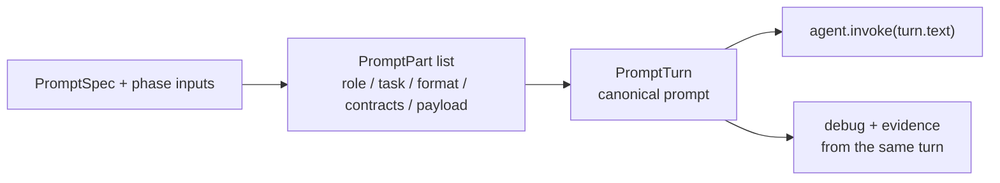
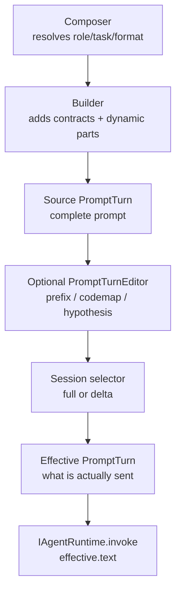
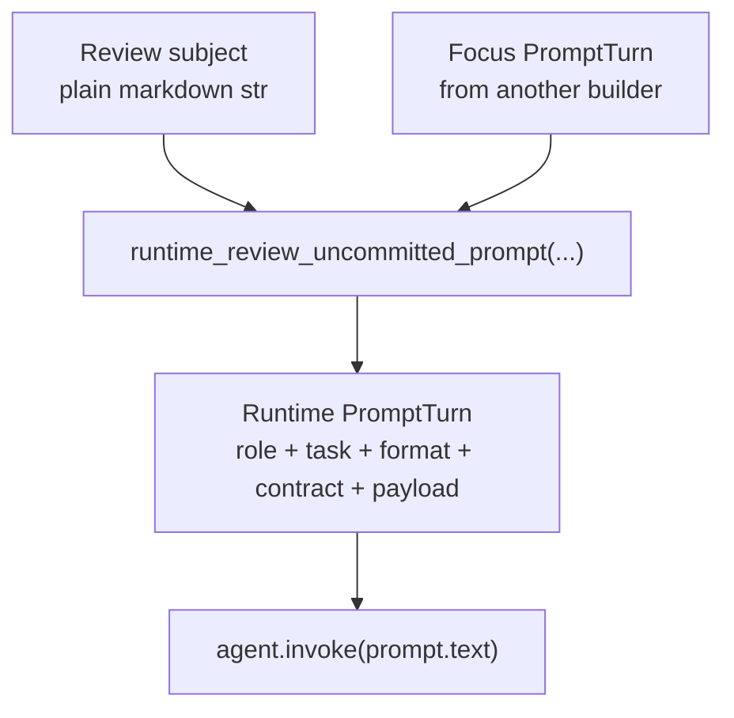
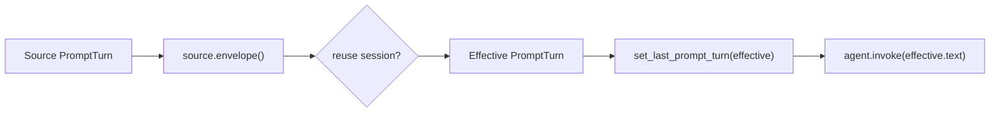
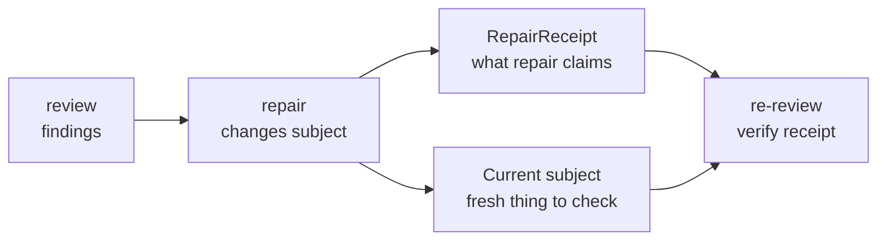

# Prompt Engine

> Start here if you are new to Orcho's prompt engine. This page is the
> minimum working model: what a prompt is, where strings are allowed, and how
> prompts reach an agent runtime. For implementation details, see
> [Prompt Engine Deep Dive](prompt_engine_deep_dive.md). For the design record,
> see [ADR 0060](../adr/0060-prompt-turn-canonical-render-surface.md).

## The model in one sentence

A runtime prompt is not "a string plus metadata"; it is a typed
`PromptTurn`, and every runtime/debug/cache surface is projected from that
turn.



## Why this matters

Prompts carry two different things:

- policy: JSON contracts, review targets, handoff rules, language posture;
- payload: task text, plans, diffs, critique, test output, repo maps.

If those bytes are copied into a raw string and metadata is kept somewhere
else, the two surfaces drift. Orcho avoids that by keeping every meaningful
byte attached to a typed `PromptPart` until the final runtime boundary.

## The four names you need

| Name | What it means |
| --- | --- |
| Review subject | A document/body to be reviewed, such as bundle markdown or a release summary. This may be a plain `str`. |
| `PromptPart` | A typed semantic chunk of a prompt: role, task, format, contract, artifact, codemap, critique, and so on. |
| `PromptTurn` | The canonical runtime prompt: ordered segments, parts, envelope, trace view, and wire text. |
| Wire prompt | `turn.text`, the final string passed to `IAgentRuntime.invoke`. |

The key rule:

- `str` is allowed before something becomes a runtime prompt.
- `PromptTurn` is required once something is a runtime prompt.
- `turn.text` is extracted only at `IAgentRuntime.invoke`.

## Normal prompt flow



In code, the last step should look like this:

```python
from core.observability.prompt_trace import set_last_prompt_turn

turn = some_prompt_builder(...)
set_last_prompt_turn(turn)
raw = agent.invoke(turn.text, cwd)
```

Most phase paths should not do this by hand. Prefer the session-aware helpers:

- `pipeline.phases.builtin._session_aware_invoke(...)`;
- `pipeline.cross_project.session_invoke.session_aware_invoke(...)`.

## Where strings are allowed

Strings are allowed for input documents that are not runtime prompts yet:

- artifact bundle markdown;
- contract-check focus text;
- cross-final-acceptance focus text;
- raw file contents;
- rendered review subjects.

Those strings become prompt payload through a builder. After that boundary,
the runtime prompt is a `PromptTurn`.

## The review wrapper boundary

`runtime_review_uncommitted_prompt(...)` is the one intentional
normalization boundary for reviewer prompts.



This is why that function accepts `str | PromptTurn`: it converts a review
subject or focus turn into a new canonical runtime prompt. This is not a
general license to pass strings around the prompt engine.

## The source/effective split

Session-aware rendering has two turns:

- source turn: the complete prompt, used for cache/session selection;
- effective turn: the actual wire prompt, either full or delta.



Debug output must show the effective turn, because that is what the model
actually received. Cache/session selection must use the source turn, because
it needs to know the whole prompt.

## Repair receipts in re-review

Session continuity is valuable in review/repair loops: a resumed reviewer
remembers the earlier finding, the contract, and any operator decision. The
risk is stale memory. After a repair, a reviewer must not have to guess what
changed.

Orcho carries a small re-review packet on resumed review turns:



The packet has two dynamic prompt parts:

| Part | Meaning |
| --- | --- |
| `repair_receipt:latest` | What the repair phase claims it fixed, waived, or left open. |
| `current_review_subject:latest` | Fresh projection of the thing being reviewed now. |

Both parts are `TURN` / `NONE`, so a resumed delta render must send them. The
reviewer keeps the same session, but receives fresh evidence and the repairer's
claim before answering again.

The current subject is phase-owned:

- plan re-review uses the in-memory `parsed_plan` projection;
- code/file re-review uses the active project change state;
- neither rule makes the protocol depend on git or worktrees.

## Rules of thumb

Do:

- return `PromptTurn` from runtime prompt builders;
- add post-builder material through `PromptTurnEditor`;
- publish the effective turn immediately before runtime invoke;
- pass only `turn.text` into `agent.invoke`;
- use source turn for session/cache selection and effective turn for debug.
- after repair/replan, include a repair receipt and fresh current subject in
  the next resumed review.

Do not:

- append text to a prompt string after a builder returns;
- put a `PromptTurn` into an f-string;
- pass a `PromptTurn` object to `agent.invoke`;
- set the trace slot from inside a builder;
- maintain a string and a metadata sidecar in parallel.

## Where to go next

- [Prompt Engine Deep Dive](prompt_engine_deep_dive.md): core types,
  cache/session semantics, builder checklist, debugging, and regression tests.
- [ADR 0060](../adr/0060-prompt-turn-canonical-render-surface.md): why
  `PromptTurn` became the canonical render surface.
- [ADR 0066](../adr/0066-repair-receipt-re-review-protocol.md): why
  re-review receives repair receipts and current subjects.
- `tests/unit/pipeline/prompts/test_prompt_turn.py`: executable invariants.
