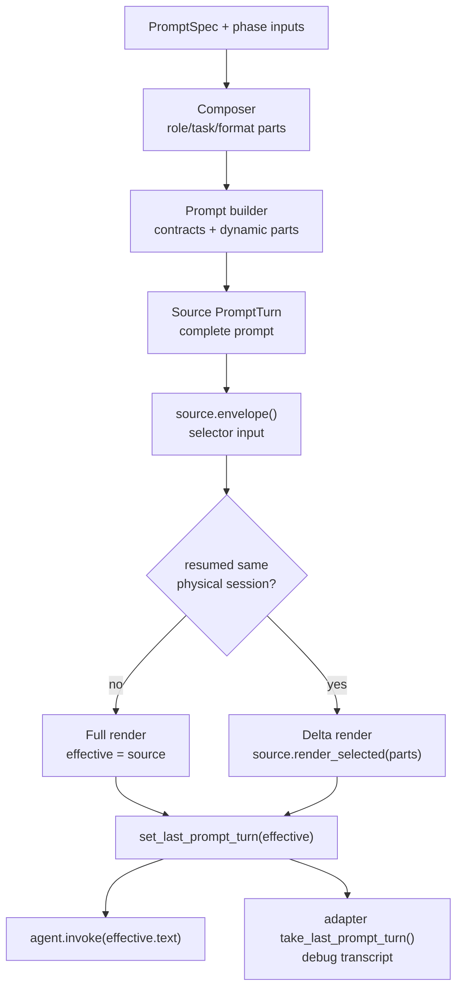

# Prompt Engine Deep Dive

> Implementation guide for developers changing the prompt engine. Start with
> [Prompt Engine](prompt_engine.md) if you only need the mental model.

## Core types

### `PromptPart`

`PromptPart` is the semantic unit of prompt composition. It carries:

- `kind`, `name`, `source`, and `body`;
- cache/session metadata: `layer`, `stability`, `cache_scope`;
- identity metadata: `id`, optional `version`, optional `artifact_path`;
- `volatile_reason` for non-static parts.

Parts answer "what is this text and how may it be reused?"

### `PromptSegment`

`PromptSegment` is one physical wire segment:

```python
PromptSegment(
    text="\n\n" + part.body,
    part=part,
    segment_id="unique-within-turn",
)
```

The separator glue belongs to the segment text. This lets trace/debug render
exactly the bytes that went on the wire without rejoining or guessing.

Invariants:

- if `part.body` is non-empty, it appears exactly once in `segment.text`;
- if `part.body` is empty, `segment.text == ""`;
- `segment_id` is unique within the owning `PromptTurn`;
- rebased delta segments keep `source_segment_id` pointing to the source turn.

### `PromptTurn`

`PromptTurn` is the canonical runtime prompt:

```python
turn.text          # wire prompt
turn.parts         # ordered PromptPart metadata
turn.envelope()    # cache/session selector input
turn.trace_view()  # debug transcript input
turn.render_selected(selected_parts)  # delta prompt
```

Every runtime prompt builder returns `PromptTurn`. Builders do not publish
trace context and do not call runtimes.

### `PromptTurnEditor`

`PromptTurnEditor` is the only supported way to edit a turn after a builder
returns it:

```python
turn = (
    PromptTurnEditor(base_turn)
    .prepend(prefix_part)
    .append(codemap_part)
    .append(hypothesis_part)
    .build()
)
```

Use it for attachment prefixes, repo maps, hypothesis context, and other
post-builder additions. Empty-body parts are preserved as zero-byte segments
because they may still carry envelope identity.

### `PromptTraceView`

`PromptTraceView` is the transcript/debug projection. Runtime adapters consume
it after `take_last_prompt_turn()` and render each `segment.text` with the
owning part metadata.

## Full lifecycle

The normal flow is:

1. A profile step supplies a `PromptSpec` and phase inputs.
2. The composer resolves role/task/format prompt parts.
3. The builder adds code-owned contracts and dynamic artifact parts.
4. `assemble_cache_first_segments(...)` orders parts by cache breadth and
   returns a source `PromptTurn`.
5. Optional edits happen through `PromptTurnEditor`.
6. A session-aware invoke helper selects full vs delta using the source
   turn's envelope.
7. The effective turn is published with `set_last_prompt_turn(effective_turn)`.
8. The runtime receives only `effective_turn.text`.
9. The adapter performs one `take_last_prompt_turn()` and renders trace/debug
   from the same effective turn that was sent.



Source turn and effective turn are deliberately different concepts:

- source turn: complete prompt, used for cache/session selection;
- effective turn: actual wire prompt, full or delta, used for runtime/debug.

## Review subjects and wrapper normalization

Review subjects such as artifact bundles, contract-check summaries, and
cross-final-acceptance focus documents may exist as plain markdown strings
while they are still just the subject being reviewed. They are not runtime
prompts yet.

`runtime_review_uncommitted_prompt(...)` is the explicit review-wrapper
boundary. It may receive a review subject as `str`, or a focus `PromptTurn`
from another prompt builder. It normalizes that input into a new typed
`PromptPart`, attaches reviewer role/task/format and JSON contract parts, and
returns a canonical `PromptTurn`.

This is the only place where `str | PromptTurn` is intentional. It means:

- `str` review subjects are acceptable before the wrapper;
- after the wrapper, callers handle a `PromptTurn`;
- runtime invocation still uses `turn.text` at the boundary.

## Re-review freshness protocol

Review/repair loops need one semantic bridge above prompt rendering. The
reviewer produces findings, the repairer changes the subject, and the next
reviewer must check what changed. The transport alone cannot infer that.

Orcho uses `pipeline.repair_protocol.RepairReceipt` for the bridge:

```python
RepairReceipt(
    source_phase="review_changes",
    source_round=1,
    repair_phase="repair_changes",
    repair_round=1,
    fixed=(ReceiptItem(...),),
    waived=(),
)
```

The receipt is a claim, not proof. The prompt text explicitly tells the
reviewer to verify it against the fresh subject and not to repeat an old
finding without fresh evidence.

The next resumed review receives two parts:

| Part id | Layer / cache | Source | Body |
| --- | --- | --- | --- |
| `repair_receipt:latest` | `TURN` / `NONE` | `artifact` | Rendered `RepairReceipt`. |
| `current_review_subject:latest` | `TURN` / `NONE` | `artifact` | Phase-owned fresh subject projection. |

Because both parts are `TURN` / `NONE`, the delta selector always keeps them
on the wire when they are present. Stable method parts may be omitted on a
resumed session; the repair receipt and current subject may not.

### Plan loop

For `plan -> validate_plan -> replan -> validate_plan`, the subject is not git
state. It is the current typed plan in pipeline state:

```text
state.parsed_plan
  -> render_plan_contract(...)
  -> render_validate_plan_tasks(...)
  -> current_review_subject:latest
```

This keeps plan re-review correct even when no markdown file or code diff is
the source of truth.

### Code/file review loop

For `review_changes -> repair_changes -> review_changes`, the subject is the
active project change state. The default renderer includes lightweight
`git status --short -uall` and `git diff --stat` when available, and degrades
to an explicit "unavailable" note outside git. This is a phase-owned
projection, not a protocol requirement that every subject be git-backed.

### Invoke rule

A review turn includes the re-review packet when:

```text
_should_resume(state, "repair_round") is true
and state.extras["_last_repair_receipt"] exists
```

This covers both review paths:

- normal leading round-2 review after round-1 repair;
- final deferred post-repair re-review before a handoff pause.

It deliberately does not start a fresh reviewer session. The same session is
resumed, but the fresh packet prevents stale-memory-only answers.

## Cache and session semantics

Provider prefix caching depends on a contiguous byte-identical prefix. Orcho
therefore sorts prompt parts into a cache-first physical layout:

1. prefix-eligible parts first;
2. broader cache scopes before narrower scopes:
   `GLOBAL -> WORKSPACE -> PROJECT -> SESSION -> NONE`;
3. kind sub-order keeps protected contracts, role, format, task method, and
   context in a stable order.

`PromptPart` metadata drives whether a part may be omitted on a resumed
session:

- `cache_scope` says how broadly the bytes may be reused;
- `stability` says how often the body changes;
- `id@version` identifies what has already been sent.

`PromptSessionSplit` controls how reuse is grouped:

- `STATELESS`: always render full, no stored prompt-session state;
- `PER_PHASE`: reuse within a phase;
- `PER_ROLE`: reuse across phases that share a prompt role;
- `COMMON`: one reusable prompt session per run/runtime/model.

The selector always reads the source turn's envelope. If it chooses delta,
`PromptTurn.render_selected(...)` rebases selected parts into a fresh effective
turn with correct separator glue.

## How to add a prompt builder

Use this checklist:

1. Return `PromptTurn`, not `str`.
2. Route through `_render_prompt_output(...)` or
   `assemble_cache_first_segments(...)`.
3. Put dynamic data in explicit `PromptPart`s.
4. Give volatile parts `stability`, `cache_scope`, and `volatile_reason`.
5. Keep parser contracts and review-target policy code-owned.
6. Do not call `set_last_prompt_turn()` from the builder.
7. Add tests that inspect `turn.text`, `turn.parts`, and `turn.envelope()`.

Builder output should be deterministic for the same inputs.

## How to invoke a prompt

Prefer the session-aware helpers:

- `pipeline.phases.builtin._session_aware_invoke(...)`;
- `pipeline.cross_project.session_invoke.session_aware_invoke(...)`.

For direct invoke paths, use the same boundary pattern:

```python
from core.observability.prompt_trace import set_last_prompt_turn

turn = some_prompt_builder(...)
set_last_prompt_turn(turn)
raw = agent.invoke(turn.text, cwd, continue_session=continue_session)
```

If a direct path needs full/delta selection, do not reimplement it locally.
Route through the session-aware helper.

## Debugging model

When debugging a prompt issue, ask these questions in order:

1. What builder produced the source `PromptTurn`?
2. Were any post-builder edits applied through `PromptTurnEditor`?
3. Did the invoke boundary publish the effective turn?
4. Did the runtime adapter take exactly one prompt turn?
5. Does the debug transcript render `trace_view().segments`, not a separately
   rebuilt string?
6. Was cache/session selection based on the source envelope?
7. If delta was selected, did `render_selected(...)` receive parts from the
   same source turn by object identity?
8. For review after repair, did the effective prompt contain
   `repair_receipt:latest` and `current_review_subject:latest`?

## Regression tests and guards

The prompt engine is protected by:

- `tests/unit/pipeline/prompts/test_prompt_turn.py` for core invariants;
- `tests/unit/pipeline/prompts/test_no_raw_prompt_append.py` for raw append
  regressions in invoke paths;
- `tests/unit/pipeline/prompts/test_prompt_boundary.py` for prompt contract
  boundaries;
- `tests/unit/pipeline/prompts/test_wire_cache_layout.py` for cache-first
  ordering;
- phase/session tests for full vs delta behavior;
- `tests/unit/pipeline/phases/test_review_repair_prompt_session.py` for
  leading round-2 review and deferred re-review receipt injection;
- `tests/unit/pipeline/phases/test_validate_plan_prompt_session.py` for
  plan re-review receipt injection from `parsed_plan`;
- runtime tests that fail when `agent.invoke(...)` receives a `PromptTurn`
  instead of `turn.text`.

## Common mistakes

Avoid these patterns:

```python
prompt = builder(...)
prompt = f"{prompt}\n\nextra"          # leaks PromptTurn repr or loses parts
agent.invoke(prompt, cwd)              # passes PromptTurn, not wire text
agent.invoke(turn.text, cwd)           # missing set_last_prompt_turn(...)
set_last_prompt_turn(source_turn)      # wrong if delta was selected
```

Use these patterns instead:

```python
turn = builder(...)
turn = PromptTurnEditor(turn).append(extra_part).build()
set_last_prompt_turn(turn)
agent.invoke(turn.text, cwd)
```

For session-aware phases:

```python
_session_aware_invoke(agent, state, phase="review_changes", turn=turn, cwd=cwd)
```

## Relationship to ADRs

This document is the implementation guide. The design records are:

- [ADR 0060](../adr/0060-prompt-turn-canonical-render-surface.md): canonical
  render surface;
- [ADR 0063](../adr/0063-resume-delta-task-drop.md): resume-delta task drop —
  `delta_droppable_part_ids` / `will_render_delta`, dropping the already-in-history
  task from the wire on resumed plan/validate rounds;
- [ADR 0066](../adr/0066-repair-receipt-re-review-protocol.md): repair receipt
  and current subject packet for resumed re-review;
- ADR 0026: prompt-part metadata and session semantics;
- ADR 0028: cache-first wire layout;
- ADR 0055: session-aware delta rendering.
